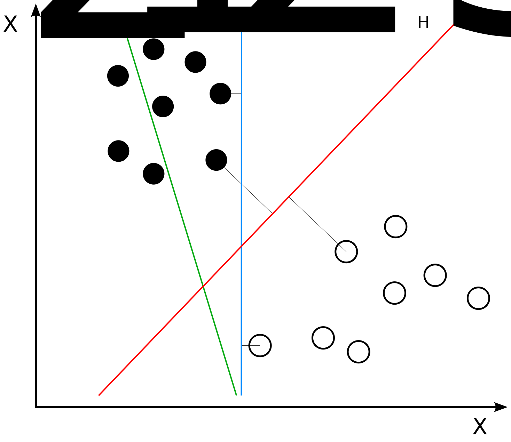
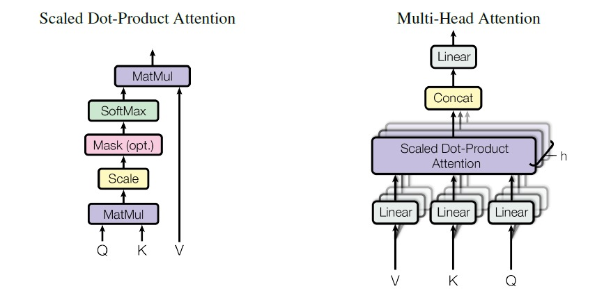
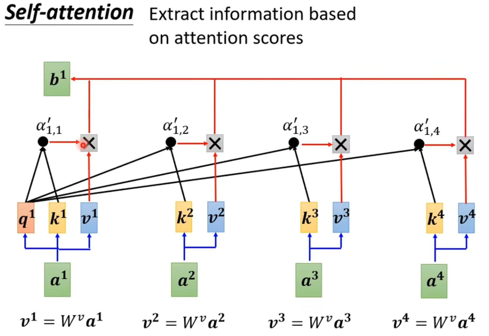
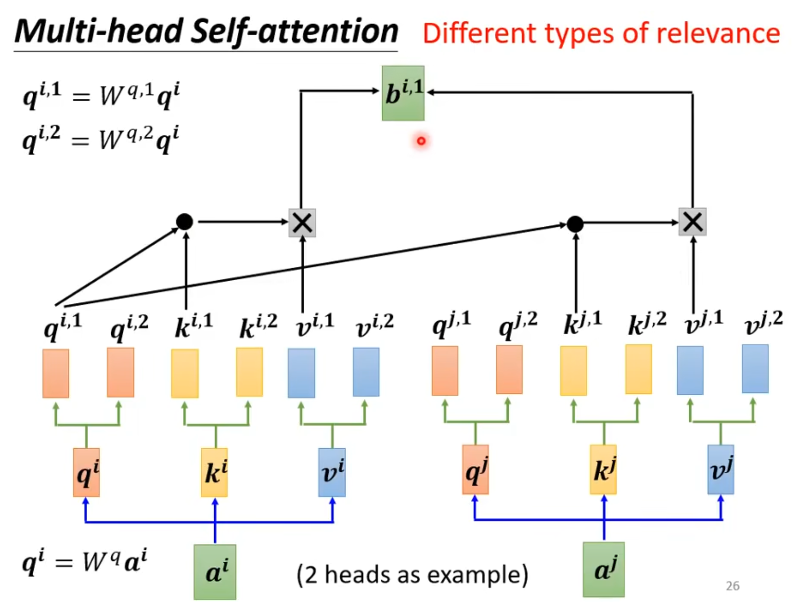

# latex

向量和矩阵加粗：

$$
\boldsymbol{x}\quad \mathbf{W}\quad \vec{x}
$$

# 评估指标

**精确率、精度（Precision）**

$$
Precision=\frac{TP}{TP+FP}
$$

**召回率（Recall）**

$$
Recall=\frac{TP}{TP+FN}=\frac{TP}{P}
$$

**F1**

$$
F1=\frac{2PR}{P+R}
$$

# SVM

寻找最佳超平面，最佳超平面的一个合理选择是以最大间隔把两个类分开的超平面。因此，我们要选择能够让到每边最近的数据点的距离最大化的超平面。



核函数


# 正则化

dropout在线性模型中和L2正则项等价

L2正则项和

# Attention

**self_attention：** 表示Q,K,V来源于同一个地方

**cross_attention：** 表示Q 与 K,V 来源于不同的地方

**[multihead attention：](https://finisky.github.io/2020/05/25/multiheadattention/)：** 如图所示，所谓Multi-Head Attention其实是把QKV的计算并行化，原始attention计算d_model维的向量，而Multi-Head Attention则是将d_model维向量先经过一个Linear Layer，再分解为h个Head计算attention，最终将这些attention向量连在一起后再经过一层Linear Layer输出。所以在整个过程中需要4个输入和输出维度都是d_model的Linear Layer，而整个Model的输入是(batch_size, seq_length, d_model)，输出也是(batch_size, seq_length, d_model)。



## Attention的计算方法



$k,q,v$矩阵计算方法：

$$
q^i=W^qa^i\\
k^i=W^ka^i\\
v^i=W^va^i
$$

注意力$\alpha$（标量）计算方法：

$$
\alpha_{i,j}=q^i\cdot k^j
$$

$\alpha'$可以有多种计算方式：

$$
\alpha'=softmax(\alpha)\\
\alpha'=RELU(\alpha)\\
$$

**多头注意力**

类似于三维的卷积核，将$W_q,W_k,W_v$矩阵增加一个维度，就是多头注意力机制。



## 从池化的角度理解

对于给定数据：

$$
(x_i,y_i),i=1,2,...,n
$$

平均池化是：

$$
f(x)=\frac{1}{n}\sum_iy_i
$$

Attention池化，就是根据当前数据和所有其他数据根据$x$计算一个权重，对$y$进行加权平均。对应上图其中$x$对应query，$x_j$对应key，$y_i$对应value。：

$$
f(x)=\sum_i\alpha(x,x_i)y_i
$$

在上世纪六十年代就存在了类似于Attention的Nadaraya-Waston核回归。$K()$是一个函数，用来衡量距离：

$$
f(x)=\sum^n_{i=1}\frac{K(x-x_i)}{\sum^n_{j=1}K(x-x_j)}y_i
$$

$K()$可以有很多形式，如果使用高斯核：

$$
K(u)=\frac{1}{\sqrt{2\pi}}exp(-\frac{u^2}{2})
$$

将$K(u)$带入到$f(x)$中可以得到：

$$
f(x)=\sum^n_{i=1}softmax(-\frac{1}{2}(x-x_i)^2)y_i
$$

加入可学习的参数$w$即可得到：

$$
f(x)=\sum^n_{i=1}softmax(-\frac{1}{2}((x-x_i)w)^2)y_i
$$

```python
import torch
import torch.nn as nn


class Att(nn.Module):
    def __init__(self, hidden_size):
        super(Att, self).__init__()
        self.hidden_size = hidden_size
        self.query = nn.Linear(hidden_size, hidden_size)
        self.key = nn.Linear(hidden_size, hidden_size)
        self.value = nn.Linear(hidden_size, hidden_size)
        self.softmax = nn.Softmax(dim=-1)

    def forward(self, inputs):
        Q = self.query(inputs)
        K = self.key(inputs)
        V = self.value(inputs)
        # i 表示batch size，q 表示 query 序列的长度，k 表示 key 序列的长度，e 表示线性变换后的维度
        att = torch.einsum('iqe,ike->iqk', Q, K) / torch.sqrt(torch.tensor(self.hidden_size))
        att = self.softmax(att)
        # 
        out = torch.einsum('iqk,ike->iqe', att, V)
        return out

if __name__ == '__main__':
    att = Att(768)
    inputs = torch.randn(2, 3, 768)
    out = att(inputs)
    print(out.shape)
```

# 带权重的方法

$$
n = f(l,w)\\
c = g(n,e)\\
c = g(f(l,w),e)\\
c = h(l,w,e)\\
C_{b,3} = E_{b,768}(L_{3,1356}W_{1356,768})^T\\
loss = CE(True_{b,3},softmax(C_{b,3}))\\
求：
\frac{\partial loss}{\partial w} = \frac{\partial loss}{\partial c}\frac{\partial c}{\partial n}\frac{\partial n}{\partial w}\\
$$

$$
softmax(C_{b,3})_{i,j} = p(y=j|C_i) = \frac{e^{C_i^TW_j}}{\sum^K_{k=1}e^{C_i^TW_k}}\\
CE(True, Pred) = -\frac{1}{b}\sum_{i=1...b}\sum_{j=1,2,3}True_{i,j}logPred_{i,j}\\
$$

# 数学

### 排列组合

$$
C^m_n=\frac{A^m_n}{m!}=\frac{n!}{m!(n-m)!}\\
C^m_n=C^{n-m}_n
$$

## 线性代数

### 线性变换

**变换**可以理解成是一个函数，即将原向量 $\boldsymbol{x_i}$ 经过一个函数输出 $\boldsymbol{y_i}$ 。对于线性变换，可以理解成对 $\boldsymbol{x_i}$ 各个维度乘以一个向量，最后求和，展开理解为：
$$
\begin{gathered}
\begin{bmatrix} a & b \\ c & d \end{bmatrix}
\begin{bmatrix} x \\ y \end{bmatrix}
=x\begin{bmatrix} a \\ c \end{bmatrix}
+y\begin{bmatrix} b \\ d \end{bmatrix}
=\begin{bmatrix} ax+by \\ cx+dy \end{bmatrix}
\end{gathered}
$$

具体的算法是将一组新的基 $\mathbf{W}=[\boldsymbol{\omega_1}, \boldsymbol{\omega_2},..., \boldsymbol{\omega_n}]$ 对一组向量 $\mathbf{X}=[\boldsymbol{x_1}, \boldsymbol{x_2},..., \boldsymbol{x_n}]$ 进行基变换得到 $\mathbf{Y}=[\boldsymbol{y_1}, \boldsymbol{y_2},..., \boldsymbol{y_n}]$

矩阵乘法的方式表示为：

$$
\mathbf{Y}=\mathbf{W}\mathbf{X}
$$


### 矩阵运算

哈达马乘积（Hadamard product）约束与加法相同，只是对应元素运算变为乘法。记作 ∘ 或 ∗ 或 ⊙。即对应位置元素乘法。


### 对角阵左乘

用对角阵左乘一个矩阵，就是用对角阵的对角元分别乘这个矩阵的对应各行；
用对角阵右乘一个矩阵，就是用对角阵的对角元分别乘这个矩阵的对应各列。

# 信息论

**信息量：**

假设$X$是一个离散型随机变量，其取值集合为 $\mathcal{X}$ ,概率分布函数$p(x)=Pr(X=x),x∈X$,则定义事件$X=x_0$的信息量为： $I(x_0)=−log(p(x_0))$

**熵：**

熵值越大，不确定性越大
$$
H(X)=-\sum_{i=1}^np(x_i)\log(p(x_i))
$$

**联合熵（joint entropy）**

$$
H(X,Y)=-\sum_{x\in X}\sum_{y\in Y}p(x,y)\log_2p(x,y)
$$

$$
H(X,Y)=H(X)+H(Y|X)
$$

**条件熵（conditional entropy）**
$$
\begin{align*}
H(Y|X)&=\sum_{x\in X}H(Y|X=x)\\
&=H(X,Y)-H(X)
\end{align*}
$$


**相对熵（KL散度）：**

非对称
$$
D_{KL}(p||q)=\sum_{i=1}^n{p(x_i)}{\log(\frac{p(x_i)}{q(x_i)})}
$$

$$
D_{KL}(p||q)
$$

**交叉熵：**

$$
\begin{align*}
D_{KL}(p||q)&=\sum^n_{i=1}p(x_i)\log(\frac{p(x_i)}{q(x_i)})\\
&=\sum^n_{i=1}p(x_i)log(p(x_i))-\sum^n_{i=1}p(x_i)\log(q(x_i))\\
&=-H(p(x))+[-\sum^n_{i=1}p(x_i)\log(q(x_i))]
\end{align*}
$$

$$
H(p,q)=-\sum^n_{i=1}p(x_i)log(q(x_i))
$$

$$
H(p,q)=H(p)+D_{KL}(p||q)
$$

在使用交叉熵作为损失函数的时$p$为**标签**，所以$p$的熵$H(p(x))$是一个**常数**。

**信息增益（Information gain）：**

$A$对于$D$的信息增益为：
$$
g(D,A)=H(D)-H(D|A)
$$

# 多模态

> 不同空间下的表示可以做attention吗？(ViLBert)
>
> 可以，但不好。
>
> 把不同模态的特征映射到相同的向量空间的操作叫align。代表作是OpenAI的CLIP，Google的Align。用一个模型把不同模态的特征混在一起用来完成某项任务，叫做Fuse。代表作有微软的UNITER，OSCAR等。
> 
> UNITER一类Fuse模型都是对尚未align的vision和text特征作cross attention，事实证明了其可行性。Transformer的线性层可以学习向量的空间变换。但相同的网络，如果用align好的特征再去fuse，是不是模型的训练更容易？结论是肯定的。可以参考Salesforce的论文Align Before Fuse，他们处理的就是你提到的这个事，结论是有效果的。

# 面试问题

### 如何解决长尾问题？

### 交叉熵和KL散度（相对熵）？

### 模型效果不佳如何优化模型？

# Bert

[bert 参数计算](https://github.com/google-research/bert/issues/656)

[bert输出层](https://github.com/huggingface/transformers/issues/7540)
